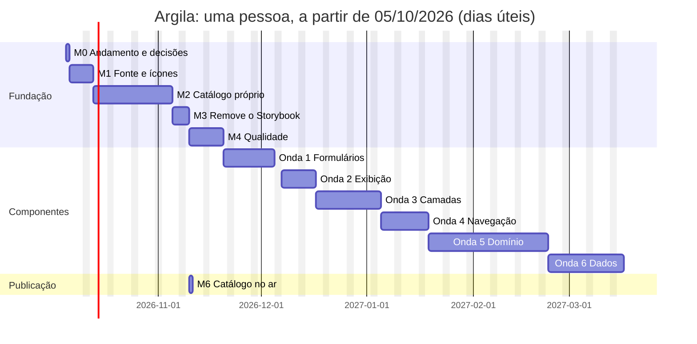

# Plano de execução: design system 100% nosso

Ordem de trabalho para executar o [design system próprio](design-system-proprio.md), PR a PR. Cada linha das tabelas é **um PR** (ou uma tarefa fora do código, marcada como tal), com o que precisa estar pronto antes, como saber que terminou e quanto tempo deve levar.

Ao final do plano, o Argila tem **41 componentes**, ícones desenhados pelo time, catálogo próprio no lugar do Storybook e **nenhum objeto de terceiros** no design system.

## Como usar este plano

- **Marque a caixa** de cada item quando o PR for mergeado na `main`, no próprio PR (este arquivo é atualizado junto).
- **Toda branch nasce da `main` atualizada.** Não empilhe um PR sobre outro ainda aberto: foi assim que o PR #3 acabou mergeado na branch errada. Se precisar empilhar, troque a base para `main` no GitHub antes do merge.
- **Todo PR segue** o [padrão de pipeline](padrao-de-pipeline.md) e, se for componente, o [checklist de componente pronto](design-system-proprio.md#checklist-de-um-componente-pronto).
- **Estimativas** são aproximadas, em dias de trabalho de uma pessoa, e incluem testes e documentação. Servem para planejar, não como prazo.
- **Coluna "Depende de":** o item só começa quando esses estiverem mergeados.

## Onde estamos

_Atualizado em 07/10/2026._

| Marco | Situação                                                                                                   |
| ----- | ---------------------------------------------------------------------------------------------------------- |
| M0    | **Código pronto** (PR-01 a PR-03 mergeados). Faltam OPS-01 (importar o ruleset) e OPS-02 (responder D1-D4) |
| M1    | **Código pronto** (PR-04 a PR-06). Faltam DES-01 (desenhar os ~40 ícones) e PR-07 (exportá-los)            |
| M2    | **Pronto** (PR-08 a PR-13): o catálogo próprio de componentes                                              |
| M3    | **Pronto** (PR-14 e PR-15): Storybook removido; `npm run dev` abre o catálogo                              |
| M4    | **Pronto** (PR-16 a PR-19): acessibilidade, contraste, checagem do catálogo e utilitários internos         |
| M5    | Onda 1 em andamento: W1-01 (Icon Button) pronto. **Próximo:** W1-02 (Link)                                 |
| M6    | Pode começar a qualquer momento; depende da decisão D3 (onde hospedar o catálogo)                          |

**O que já funciona no catálogo** (`npm run dev`, <http://localhost:4200>):

- Barra de tema (claro, escuro, automático) e de marca, com o próprio `ArgTheme`; barra lateral com busca; menu no celular.
- Página de componente a partir do `*.docs.ts`: playground com controles gerados e estado na URL, exemplos com "Ver código", propriedades, tokens do componente, faça/não faça e acessibilidade.
- Páginas Início, Tokens (valores no tema atual) e Ícones (busca e cópia do código).
- Páginas de Button, Icon, List, Skeleton e Spinner, e o padrão Carregamento de lista; o teste do registro renderiza todos os exemplos.

**Pendências conhecidas:**

- Só existem 3 ícones de exemplo (`plus`, `x`, `check`); o botão "Menu" do catálogo fica sem ícone até o `menu` ser desenhado.
- Decisões D1 a D4 sem resposta: o trabalho segue a opção padrão de cada uma.
- PR-04 a PR-13 foram entregues juntos num único PR, com um commit por item.
- O PR-15 foi feito antes do DES-01 (desenho dos ícones), por decisão do time: remover o Storybook não depende dos ícones.
- D1 seguiu a opção padrão: sem `axe-core`. As verificações próprias (`projects/ui/src/testing/a11y.ts`) rodam nos testes de cada componente, em cada exemplo e em cada página do catálogo.
- O workflow Release falha até ligar **Settings → Actions → General → "Allow GitHub Actions to create and approve pull requests"**.

## Visão geral

| Marco | Entrega                                                         | Depende de | Estimativa       |
| ----- | --------------------------------------------------------------- | ---------- | ---------------- |
| M0    | Trabalho em andamento fechado e decisões tomadas                | —          | 1 dia            |
| M1    | Fonte do sistema, padrão e componente de ícones                 | M0         | 5 dias + desenho |
| M2    | Catálogo próprio funcionando ao lado do Storybook               | M0         | 17 dias          |
| M3    | Storybook removido; `npm run dev` abre o catálogo próprio       | M1, M2     | 3 dias           |
| M4    | Verificações de qualidade próprias e utilitários compartilhados | M3         | 8 dias           |
| M5    | 36 componentes novos, em 6 ondas (o 37º, Icon, sai no M1)       | M4         | 83 dias          |
| M6    | Catálogo publicado com link fixo                                | M3, D3     | 1 dia            |

**Total:** cerca de 118 dias de trabalho de uma pessoa (perto de 6 meses), sem contar o desenho dos ícones. Com duas pessoas, M1 e M2 andam em paralelo e as ondas do M5 se dividem: perto de 3 meses.

A data de início (05/10/2026) é só referência para o gráfico; ajuste ao começar.

---

## Decisões pendentes

Precisam de resposta antes do marco indicado. Sem elas, o plano segue a opção padrão.

| #   | Decisão                                                                                                            | Antes de | Opção padrão                                           |
| --- | ------------------------------------------------------------------------------------------------------------------ | -------- | ------------------------------------------------------ |
| D1  | Aceitar o `axe-core` como exceção, só nos testes ([seção 5.2](design-system-proprio.md#52-acessibilidade))         | M4       | Não: só verificações próprias                          |
| D2  | Quem desenha os ícones, e com qual ferramenta                                                                      | M1       | Uma pessoa do time, em qualquer editor que exporte SVG |
| D3  | Onde hospedar o catálogo: GitHub Pages (exige plano pago se o repositório for privado), Vercel ou Cloudflare Pages | M6       | Vercel, onde os produtos já estão                      |
| D4  | Ordem da onda 5: começar pelo Time Slot Picker e pelo Date Picker, se a agenda for a próxima entrega dos produtos  | M5       | A ordem da tabela                                      |

---

## M0: fechar o que está em andamento

| ✓   | ID     | Item                                                                                              | Depende de | Pronto quando                                                   | Est. |
| --- | ------ | ------------------------------------------------------------------------------------------------- | ---------- | --------------------------------------------------------------- | ---- |
| [x] | PR-01  | `feat: biblioteca navegável de componentes com npm run dev` (branch `feat/biblioteca-dev`)        | —          | Mergeado; `npm run dev` abre a página Introdução                | —    |
| [x] | PR-02  | `feat(tokens): tokens semânticos de carregamento` (branch `feat/tokens-carregamento`)             | —          | Mergeado; `--arg-loading-*` no `:root` muda skeleton e spinner  | —    |
| [x] | PR-03  | `docs: design system próprio e plano de execução` (branch `docs/design-system-proprio`)           | —          | Mergeado; este plano revisado pelo time                         | —    |
| [ ] | OPS-01 | **Fora do código:** importar o ruleset da `main` no GitHub (Settings → Rules → Rulesets → Import) | —          | Push direto na `main` recusado pelo GitHub; merge só por squash | 0,5  |
| [ ] | OPS-02 | **Fora do código:** responder D1 a D4                                                             | PR-03      | Respostas registradas na tabela de decisões                     | 0,5  |

---

## M1: fundamentos próprios

| ✓   | ID     | Item                                                                                                                        | Depende de    | Pronto quando                                                                       | Est. |
| --- | ------ | --------------------------------------------------------------------------------------------------------------------------- | ------------- | ----------------------------------------------------------------------------------- | ---- |
| [x] | PR-04  | `feat(tokens): usa a fonte do sistema` (remove `Inter` do `--arg-core-font-sans`)                                           | M0            | Nenhuma referência a `Inter` no repositório                                         | 0,5  |
| [x] | PR-05  | `feat(icons): padrão de desenho e gerador de ícones` (`scripts/gerar-icones.ts`, testes, 3 ícones de exemplo)               | M0            | SVG fora do padrão é rejeitado com mensagem clara; testes do gerador com 80%+       | 2    |
| [x] | PR-06  | `feat(icon): componente arg-icon e provideArgIcons`                                                                         | PR-05         | `<arg-icon name="plus" />` renderiza; nome inválido não compila; tamanhos por token | 2    |
| [ ] | DES-01 | **Fora do código:** desenhar o primeiro lote (cerca de 40 ícones, lista na [seção 1.2](design-system-proprio.md#12-ícones)) | PR-05, D2     | Todos os SVGs passam no gerador                                                     | D2   |
| [ ] | PR-07  | `feat(icons): primeiro lote de ícones`                                                                                      | PR-06, DES-01 | Os ~40 ícones exportados e aparecendo no catálogo                                   | 0,5  |

---

## M2: catálogo próprio

O Storybook continua funcionando durante todo o M2; os dois convivem até o M3.

| ✓   | ID    | Item                                                                                                       | Depende de   | Pronto quando                                                                                    | Est. |
| --- | ----- | ---------------------------------------------------------------------------------------------------------- | ------------ | ------------------------------------------------------------------------------------------------ | ---- |
| [x] | PR-08 | `feat(docs): aplicação do catálogo` (`projects/docs`, layout, barra lateral, barra de tema com `ArgTheme`) | M0           | `npm run docs` abre o catálogo em `localhost:4200`, usando componentes do Argila na interface    | 3    |
| [x] | PR-09 | `feat(docs): formato DocPage, registro e rotas` (página de componente com resumo e exemplos)               | PR-08        | Página do Button com os exemplos renderizados, navegável pela barra lateral                      | 3    |
| [x] | PR-10 | `feat(docs): gerador de manifesto` (inputs, tipos, padrões, JSDoc, código dos exemplos, tokens)            | PR-09        | `manifest.json` gerado a partir do código; testes do gerador com 80%+                            | 4    |
| [x] | PR-11 | `feat(docs): tabela de propriedades e visualizador de código`                                              | PR-10        | Cada exemplo tem "Ver código" com destaque de sintaxe; tabela de propriedades vinda do manifesto | 2    |
| [x] | PR-12 | `feat(docs): playground com controles gerados`                                                             | PR-10        | Controles corretos para união de strings, `boolean`, `string`, `number`; estado na URL           | 3    |
| [x] | PR-13 | `feat(docs): páginas Início, Tokens e Ícones`                                                              | PR-10, PR-06 | Tokens mudam ao trocar tema e marca; ícones com busca e cópia do código                          | 2    |

---

## M3: migrar do Storybook e removê-lo

| ✓   | ID    | Item                                                                                                                            | Depende de | Pronto quando                                                                                 | Est. |
| --- | ----- | ------------------------------------------------------------------------------------------------------------------------------- | ---------- | --------------------------------------------------------------------------------------------- | ---- |
| [x] | PR-14 | `docs: migra componentes e padrões para o catálogo próprio` (Button, List, Skeleton, Spinner, Carregamento)                     | M2         | Tudo o que o Storybook mostra existe no catálogo, comparado lado a lado                       | 2    |
| [x] | PR-15 | `chore: remove o Storybook` (8 dependências, `.storybook/`, `*.stories.ts`, `.mdx`; `dev` abre o catálogo; CI usa `build:docs`) | PR-14, M1  | `grep -ri storybook` não acha nada fora do changelog; CI verde; `npm run dev` abre o catálogo | 1    |

**Marco atingido:** a partir daqui, nenhum objeto de terceiros no design system.

---

## M4: qualidade e base compartilhada

| ✓   | ID    | Item                                                                                                      | Depende de | Pronto quando                                                                | Est. |
| --- | ----- | --------------------------------------------------------------------------------------------------------- | ---------- | ---------------------------------------------------------------------------- | ---- |
| [x] | PR-16 | `test: verificações de acessibilidade próprias` (`src/testing/a11y.ts`, aplicadas aos componentes atuais) | M3, D1     | Remover o `label` de um componente nos testes faz o teste falhar             | 3    |
| [x] | PR-17 | `test(tokens): contraste dos tokens em claro e escuro`                                                    | M3         | Trocar `--arg-color-on-primary` por uma cor sem contraste faz o teste falhar | 1    |
| [x] | PR-18 | `ci: checagem do manifesto e build do catálogo`                                                           | M3         | Componente exportado sem página no catálogo, ou input sem JSDoc, quebra o CI | 1    |
| [x] | PR-19 | `feat(internal): utilitários compartilhados` (ids únicos, navegação por setas, anunciador `aria-live`)    | M3         | Utilitários testados com 80%+ e documentados para uso interno                | 3    |

Se D1 for "sim", o PR-16 inclui o `axe-core` como dependência de desenvolvimento, rodando dentro dos testes.

---

## M5: componentes

Cada onda depende das anteriores; dentro de uma onda, os itens podem ser feitos em qualquer ordem ou em paralelo. Todo item termina com o [checklist de componente pronto](design-system-proprio.md#checklist-de-um-componente-pronto) completo e um changeset `minor`.

### Onda 1: base de formulários (11 dias)

| ✓   | ID    | Componente              | Pronto quando, além do checklist                                           | Est. |
| --- | ----- | ----------------------- | -------------------------------------------------------------------------- | ---- |
| [x] | W1-01 | Icon Button             | Sem `label` não compila                                                    | 1    |
| [ ] | W1-02 | Link                    | Link externo mostra ícone e avisa o leitor de tela                         | 0,5  |
| [ ] | W1-03 | Divider                 | Horizontal e vertical                                                      | 0,5  |
| [ ] | W1-04 | Field                   | Rótulo, ajuda e erro ligados por ids; erro anunciado ao aparecer           | 2    |
| [ ] | W1-05 | Input, Textarea         | Funcionam com Reactive Forms e com signals; estados de erro e desabilitado | 2    |
| [ ] | W1-06 | Checkbox, Radio, Switch | Checkbox indeterminado; grupo de radio navegável por setas                 | 3    |
| [ ] | W1-07 | Select                  | Nativo estilizado, com Reactive Forms                                      | 2    |

### Onda 2: exibição e feedback simples (8 dias)

| ✓   | ID    | Componente         | Pronto quando, além do checklist                                    | Est. |
| --- | ----- | ------------------ | ------------------------------------------------------------------- | ---- |
| [ ] | W2-01 | Badge, Tag, Avatar | Tag removível por teclado; avatar com iniciais quando não há imagem | 2    |
| [ ] | W2-02 | Card               | Card inteiro clicável sem quebrar os botões internos                | 1    |
| [ ] | W2-03 | Alert              | Quatro variantes, com ícone e `role` corretos                       | 1    |
| [ ] | W2-04 | Empty State        | Usado no padrão "Carregamento de lista"                             | 1    |
| [ ] | W2-05 | Progress Bar       | Determinado e indeterminado, com nome acessível                     | 1    |
| [ ] | W2-06 | Tooltip            | Abre no foco e no hover; fecha com Esc                              | 2    |

### Onda 3: camadas (13 dias)

| ✓   | ID    | Componente | Pronto quando, além do checklist                                             | Est. |
| --- | ----- | ---------- | ---------------------------------------------------------------------------- | ---- |
| [ ] | W3-01 | Dialog     | Aberto por serviço; foco preso; devolve o foco ao fechar; confirmação pronta | 3    |
| [ ] | W3-02 | Drawer     | Lateral no desktop, de baixo no celular                                      | 2    |
| [ ] | W3-03 | Popover    | Posicionado junto ao gatilho, sem sair da tela                               | 2    |
| [ ] | W3-04 | Menu       | Setas, Home/End, busca por letra, Esc                                        | 3    |
| [ ] | W3-05 | Toast      | Fila; pausa no hover e no foco; anunciado pelo leitor de tela                | 3    |

### Onda 4: navegação (10 dias)

| ✓   | ID    | Componente | Pronto quando, além do checklist                                    | Est. |
| --- | ----- | ---------- | ------------------------------------------------------------------- | ---- |
| [ ] | W4-01 | App Shell  | Marca do tenant no cabeçalho; menu lateral vira gaveta no celular   | 4    |
| [ ] | W4-02 | Tabs       | Setas entre abas; painel ligado à aba                               | 2    |
| [ ] | W4-03 | Breadcrumb | Item atual com `aria-current`                                       | 1    |
| [ ] | W4-04 | Pagination | Total de páginas, anterior e próxima, página atual anunciada        | 1,5  |
| [ ] | W4-05 | Stepper    | Etapas feita, atual e pendente distinguíveis sem depender só de cor | 1,5  |

### Onda 5: domínio dos produtos (25 dias)

| ✓   | ID    | Componente       | Pronto quando, além do checklist                                             | Est. |
| --- | ----- | ---------------- | ---------------------------------------------------------------------------- | ---- |
| [ ] | W5-01 | Currency Input   | Digitação em R$ com centavos; valor no formulário em centavos (inteiro)      | 2    |
| [ ] | W5-02 | Masked Input     | Telefone, CPF, CNPJ e CEP, com validação de dígitos verificadores            | 3    |
| [ ] | W5-03 | Date Picker      | Calendário navegável por teclado; datas bloqueadas; digitação direta da data | 5    |
| [ ] | W5-04 | Time Slot Picker | Horários livres e ocupados; navegável por setas; estado de carregamento      | 4    |
| [ ] | W5-05 | File Upload      | Arrastar e soltar; prévia de imagem; progresso; erro por tamanho e tipo      | 5    |
| [ ] | W5-06 | Combobox         | Segue o padrão do ARIA APG; busca assíncrona com carregando e vazio          | 6    |

### Onda 6: dados complexos (16 dias)

| ✓   | ID    | Componente        | Pronto quando, além do checklist                                               | Est. |
| --- | ----- | ----------------- | ------------------------------------------------------------------------------ | ---- |
| [ ] | W6-01 | Table             | Ordenação, seleção de linhas, estados vazio e carregando, rolagem no celular   | 6    |
| [ ] | W6-02 | Calendar (Agenda) | Visão de dia e semana; agendamentos posicionados por horário; teclado completo | 10   |

---

## M6: catálogo publicado

| ✓   | ID    | Item                                                                       | Depende de | Pronto quando                                                        | Est. |
| --- | ----- | -------------------------------------------------------------------------- | ---------- | -------------------------------------------------------------------- | ---- |
| [ ] | PR-20 | `ci: publica o catálogo a cada merge na main` (no destino escolhido em D3) | M3, D3     | Link fixo no README; recarregar qualquer página do catálogo funciona | 1    |

Pode ser feito logo depois do M3, sem esperar o M4 e o M5: o catálogo publicado ganha cada componente novo automaticamente.

---

## Acompanhamento

- **Semanal:** revisar este plano no time. O que atrasou, o que mudou de prioridade, se alguma estimativa precisa ser corrigida.
- **A cada marco:** conferir o critério de pronto do marco no [guia](design-system-proprio.md) antes de começar o próximo.
- **Sugestão:** criar uma issue no GitHub para cada ID deste plano e um Project com as colunas A fazer, Em andamento, Em review e Feito. O ID no título da issue (`[W1-04] Field`) liga a issue a esta tabela.
